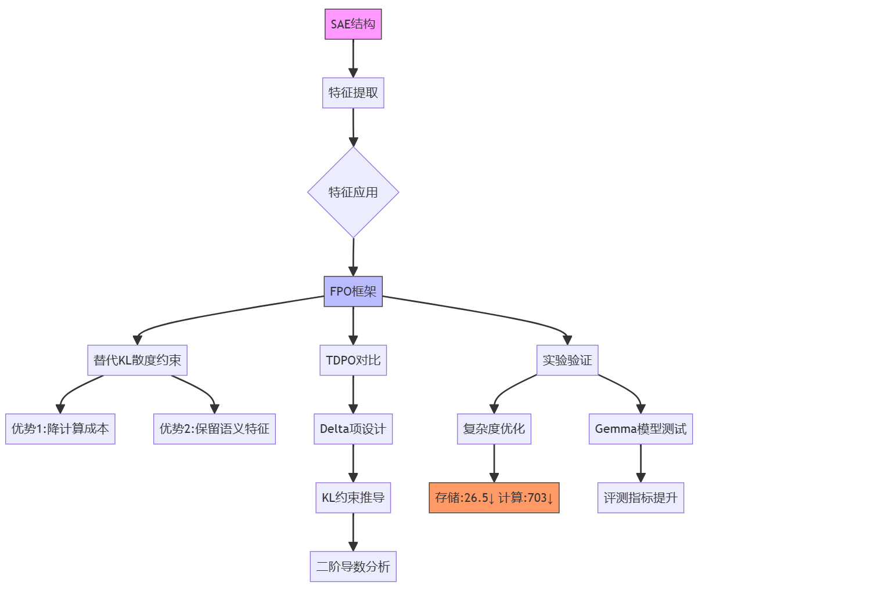

# SAE in FPO



## **Sparse Auto Encoder**

### **1. Auto-Encoder**

无监督学习 自编码器

#### 1.1 网络组件定义
| 组件            | 数学表达                                                                 | 功能描述                                                                 |
|-----------------|-------------------------------------------------------------------------|--------------------------------------------------------------------------|
| **编码器**       | $h = f_\theta(x) = \sigma(Wx + b)$                                      | 将输入$x \in \mathbb{R}^{d_x}$映射到潜在空间$h \in \mathbb{R}^{d_h}$     |
| **瓶颈层**       | $\text{dim}(h) = d_h \ll d_x$                                          | 压缩关键特征，控制信息容量                                                |
| **解码器**       | $\hat{x} = g_\phi(h) = \sigma'(W'h + b')$                              | 从潜在表示重建输入$\hat{x} \in \mathbb{R}^{d_x}$                         |
| **重建误差**     | $L(x,\hat{x}) = \|x - \hat{x}\|^2$                                     | 衡量输入与重建输出的差异                                                  |

#### 1.2 通用优化目标
$$
\min_{\theta,\phi} \underbrace{\mathbb{E}_{x \sim p_{data}} \left[ \| x - g_\phi(f_\theta(x)) \|^2 \right]}_{\text{重构损失}} + \lambda R(\theta,\phi)
$$

- $\theta = \{W, b\}$：编码器参数  
- $\phi = \{W', b'\}$：解码器参数  
- $R(\cdot)$：正则化项

---

### **2. 变体架构对比**
| 类型            | 结构特点                                                                 | 正则化项$R(\theta,\phi)$                                        | 应用场景               |
|-----------------|--------------------------------------------------------------------------|---------------------------------------------------------------|-----------------------|
| **Sparse AE**   | 隐藏层激活稀疏约束                                                       | $R = \|W\|_F^2 + \|W'\|_F^2 + \beta \Omega(h)$                | 分类任务特征学习       |

---


<summary>SAE的特征抽取</summary>

<details>


```code
我们正在研究神经网络中的神经元。每个神经元都在短文档中寻找某些特定的东西。请查看神经元激活的文档部分，并用一句话概括该神经元正在寻找什么。不要列出单词的例子。

激活格式是 token<tab>activation。激活值范围从 0 到 10。神经元找到它正在寻找的东西用非零激活值表示。激活值越高，匹配越强。

---
**示例 1**
---
Neuron 1
Activations:
<start>
the		0
sense		0
of		0
together	3
ness		7
in		0
our		0
town		1
is		0
strong		0
.		0
<end>

Activations (过滤掉零值):
<start>
together	3
ness		7
town		1
<end>

Explanation of neuron 1 behavior: the main thing this neuron does is find phrases related to community

---
**示例 2**
---
Neuron 4
Activations:
<start>
Esc		0
aping		9
the		4
studio		0
,		0
Pic		0
col		0
i		0
is		0
warmly	0
affecting	3
<end>

Activations (过滤掉零值):
<start>
aping		9
the		4
affecting	3
<end>

Explanation of neuron 4 behavior: the main thing this neuron does is find ... [此处省略，因为论文中没有给出完整的解释]

---
**... (重复多个示例)**
---

**目标神经元**
---
Neuron [目标神经元编号]
Activations:
<start>
[token1]<tab>[activation1]
[token2]<tab>[activation2]
...
<end>

Activations (如果稀疏，重复非零激活的token-activation对):
<start>
[token_非零1]<tab>[activation_非零1]
[token_非零2]<tab>[activation_非零2]
...
<end>
```

```code
我们正在研究神经网络中的神经元。每个神经元都在短文档中寻找某些特定的东西。请查看神经元的功能解释，并尝试预测其在特定token上的激活值。

激活格式是 token<tab>activation，激活值范围从 0 到 10。大多数激活将为 0。

---
**示例 1**
---
Neuron 1
Explanation of neuron 1 behavior: the main thing this neuron does is find phrases related to community
Activations:
<start>
the		0
sense		0
of		0
together	3
ness		7
in		0
our		0
town		1
is		0
strong		0
.		0
<end>

---
**示例 2**
---
Neuron 4
Explanation of neuron 4 behavior: the main thing this neuron does is find present tense verbs ending in 'ing'
Text: Starting from a position of
Last token in the text: of
Last token activation, considering the token in the context in which it appeared in the text:
```

```code
我们正在研究神经网络中的神经元。每个神经元都在短文档中寻找某些特定的东西。请查看神经元的功能解释，并尝试预测它在每个token上的激活值。

激活格式是 token<tab>activation，激活值范围从 0 到 10，"unknown" 表示未知的激活。大多数激活将为 0。

---
**示例 1**
---
Neuron 1
Explanation of neuron 1 behavior: the main thing this neuron does is find phrases related to community
Activations:
<start>
the		unknown
sense		unknown
of		0
together	3
ness		7
in		0
our		0
town		1
is		0
strong		0
.		0
<end>

---
**示例 2**
---
Neuron 4
Explanation of neuron 4 behavior: the main thing this neuron does is find present tense verbs ending in 'ing'
Activations:
<start>
Star		unknown
ting		unknown
from		unknown
a		unknown
position	unknown
of		unknown
strength	unknown
<end>

---
**目标神经元**
---
Neuron [目标神经元编号]
Explanation of neuron [目标神经元编号] behavior: [目标神经元行为解释]
Activations:
<start>
[token1]<tab>unknown
[token2]<tab>unknown
...
<end>
```
</details>


## FPO
- DPO的loss
- 抽象成一般Loss设计
- TDPO的loss，其中的delta项的设计理由
- 约束 SAE特征框定KL散度的上限
- FPO使用SAE特征抽取替代KL散度

主轴：
- 规避显示计算KL散度，降低计算开销
- SAE具有的特征表示性

## TDPO的设计

### 一般性的 Preference Optimization Loss

```math
\begin{array}{ccc}
\text{原始优化问题} & \xrightarrow{\text{引入拉格朗日乘子}} & \mathcal{L}(\pi,\lambda) \\
\downarrow & & \downarrow \\
\text{对}\pi\text{求导} & \xrightarrow{\text{得指数形式通解}} & \text{对}\lambda\text{求导} \\
& \downarrow & \\
\text{代入归一化条件} & \xrightarrow{\text{确定配分函数}} & \text{闭式解} \pi^* \\
& \downarrow & \\
\text{验证贝尔曼方程} & \xleftarrow{\text{连接Q函数}} & \text{策略优化完成}
\end{array}
```

### **一、优化问题形式化**
**目标函数**：
$$

\max_{\pi} \underbrace{\mathbb{E}_{z \sim \pi}\left[ A_{\pi_{\text{ref}}}(s_t, z) \right]}_{\text{优势期望}} - \beta \underbrace{D_{\text{KL}}\left( \pi \| \pi_{\text{ref}} \right)}_{\text{KL惩罚项}}

$$
**约束条件**：
$$

\sum_z \pi(z|s_t) = 1 \quad \text{且} \quad \pi(z|s_t) \geq 0

$$

---

### **二、拉格朗日函数构造**
引入乘子$\lambda$处理概率归一化约束：
$$
\mathcal{L}(\pi, \lambda) = \sum_z \pi(z|s_t) A(s_t,z) - \beta \sum_z \pi(z|s_t) \log\frac{\pi(z|s_t)}{\pi_{\text{ref}}(z|s_t)} + \lambda \left(1 - \sum_z \pi(z|s_t)\right)
$$
其中 $ A(s_t,z) \equiv A_{\pi_{\text{ref}}}(s_t,z) $

---

### **三、极值必要条件**
#### **1. 对策略变量求导**
对每个候选动作$z$，令偏导为零：
$$
\frac{\partial \mathcal{L}}{\partial \pi(z|s_t)} = A(s_t,z) - \beta \left( \log\frac{\pi}{\pi_{\text{ref}}} + 1 \right) - \lambda = 0
$$
整理得：
$$
\log\frac{\pi(z|s_t)}{\pi_{\text{ref}}(z|s_t)} = \frac{A(s_t,z) - \lambda - \beta}{\beta}
$$
指数化：
$$
\pi(z|s_t) = \pi_{\text{ref}}(z|s_t) \cdot \exp\left( \frac{A(s_t,z)}{\beta} \right) \cdot \exp\left( -\frac{\lambda + \beta}{\beta} \right)
$$

---

#### **2. 对乘子求导恢复约束**
$$
\frac{\partial \mathcal{L}}{\partial \lambda} = 1 - \sum_z \pi(z|s_t) = 0 \quad \Rightarrow \quad \sum_z \pi(z|s_t) = 1
$$

---

### **四、联立方程求解**
#### **1. 通解表达式**
将策略表达式改写为：

$$
\pi(z|s_t) = \underbrace{\pi_{\text{ref}}(z|s_t) \exp\left( \frac{A(s_t,z)}{\beta} \right)}_{\text{未归一化分布}} \cdot \underbrace{\exp\left( -\frac{\lambda + \beta}{\beta} \right)}_{C(s_t)}
$$

---

#### **2. 归一化条件应用**
代入$\sum_z \pi(z|s_t) = 1$：

$$
C(s_t) \cdot \sum_z \pi_{\text{ref}}(z|s_t) \exp\left( \frac{A(s_t,z)}{\beta} \right) = 1
$$

解得归一化因子：

$$
C(s_t) = \frac{1}{\sum_z \pi_{\text{ref}}(z|s_t) \exp\left( \frac{A(s_t,z)}{\beta} \right)} \equiv \frac{1}{Z(s_t;\beta)}
$$

---

#### **3. 最终闭式解**

$$
\pi^*(z|s_t) = \frac{\pi_{\text{ref}}(z|s_t) \exp\left( \frac{A_{\pi_{\text{ref}}}(s_t,z)}{\beta} \right)}{Z(s_t;\beta)}
$$

其中配分函数：

$$
Z(s_t;\beta) = \sum_z \pi_{\text{ref}}(z|s_t) \exp\left( \frac{A_{\pi_{\text{ref}}}(s_t,z)}{\beta} \right)
$$


## 哪里来的SeqKL:

**阶段1：Advantage的原始定义**  
在强化学习中，优势函数原本定义为：

$$
A_{\pi}(s,a) = Q_{\pi}(s,a) - V_{\pi}(s)
$$

其中：

- $Q_{\pi}$：状态-动作值函数
- $V_{\pi}$：状态值函数

**阶段2：在语言模型中的重构**  
对于序列生成任务，每个token位置对应一个"状态"，于是有：

$$
A_{\pi_{ref}}([x,y^{<t}],y^t) = Q_{\pi_{ref}}([x,y^{<t}],y^t) - \mathbb{E}_{z\sim\pi_{ref}}Q_{\pi_{ref}}([x,y^{<t}],z)
$$

**阶段3：Q函数的策略比表达**  
通过步骤2的推导，我们得到：

$$
Q_{\pi_{ref}} = \beta\log\frac{\pi_\theta^*}{\pi_{ref}} + \beta\log Z
$$

代入优势函数：

$$
A_{\pi_{ref}} = \beta\left(\log\frac{\pi_\theta^*}{\pi_{ref}} - \mathbb{E}_{z\sim\pi_{ref}}\log\frac{\pi_\theta^*}{\pi_{ref}}\right)
$$

**阶段4：KL散度的浮现**  
注意到：

$$
\mathbb{E}_{z\sim\pi_{ref}}\log\frac{\pi_\theta^*}{\pi_{ref}} = -D_{KL}(\pi_{ref} \| \pi_\theta^*)
$$

因此优势函数变为：

$$
A_{\pi_{ref}} = \beta\left[\log\frac{\pi_\theta^*}{\pi_{ref}} + D_{KL}(\pi_{ref} \| \pi_\theta^*)\right]
$$

**阶段5：序列层面的扩展**  
将单步优势扩展到完整序列（假设$\gamma=1$）：

$$
\sum_{t=1}^T A_{\pi_{ref}}^{(t)} = \beta\sum_{t=1}^T \left[\log\frac{\pi_\theta^*}{\pi_{ref}} + D_{KL}^{(t)}\right]
$$

其中：

$$
D_{KL}^{(t)} = D_{KL}(\pi_{ref}(\cdot|[x,y^{<t}]) \| \pi_\theta^*(\cdot|[x,y^{<t}]))
$$

**阶段6：SeqKL的定义**  
自然地将序列KL散度定义为：

$$
D_{SeqKL}(x,y) = \sum_{t=1}^T D_{KL}^{(t)}
$$


## 关于KL散度约束的推导


### **一、符号系统明确**
1. **定义变量**：

   - 参考logits：$z_{\text{ref}} \in \mathbb{R}^V$
   - 当前logits：$z = z_{\text{ref}} + \Delta z$
   - 概率分布：$p_{\text{ref}} = \text{softmax}(z_{\text{ref}})$
   - 当前分布：$p = \text{softmax}(z)$

2. **KL散度目标**：

   $D_{\text{KL}} = \sum_{i=1}^V p_{\text{ref},i} (\log p_{\text{ref},i} - \log p_i)$

---

### **二、一阶导数计算（梯度）**
#### **步骤1：展开求和项**
将KL散度展开为：

$D_{\text{KL}} = \underbrace{\sum p_{\text{ref},i} \log p_{\text{ref},i}}_{\text{常数项}} - \sum p_{\text{ref},i} \log p_i$

#### **步骤2：求导目标简化**
只需计算：

$\frac{\partial D_{\text{KL}}}{\partial \Delta z_k} = -\sum_{i=1}^V p_{\text{ref},i} \frac{\partial \log p_i}{\partial \Delta z_k}$

#### **步骤3：链式法则应用**
对每个$\log p_i$求导：

$\frac{\partial \log p_i}{\partial \Delta z_k} = \frac{1}{p_i} \cdot \frac{\partial p_i}{\partial \Delta z_k}$

#### **步骤4：softmax导数计算**
回忆softmax导数公式：

$\frac{\partial p_i}{\partial \Delta z_k} = p_i (\delta_{ik} - p_k)$  

其中，克罗内克δ函数：

$$\delta_{ik} = \begin{cases} 1 & \text{if } i=k \\ 0 & \text{if } i \neq k \end{cases}$$

#### **步骤5：代入并化简**
将步骤3和步骤4代入步骤2：

$$\frac{\partial D_{\text{KL}}}{\partial \Delta z_k} = -\sum_{i=1}^V p_{\text{ref},i} \cdot \frac{1}{p_i} \cdot p_i (\delta_{ik} - p_k)$$

简化分数项：

$$= -\sum_{i=1}^V p_{\text{ref},i} (\delta_{ik} - p_k)$$

展开求和：

$$= -\left[ \sum_{i=1}^V p_{\text{ref},i} \delta_{ik} - \sum_{i=1}^V p_{\text{ref},i} p_k \right]$$

第一项由于δ函数性质只剩下$p_{\text{ref},k}$，第二项中$p_k$与$i$无关可提出：

$$= -\left[ p_{\text{ref},k} - p_k \sum_{i=1}^V p_{\text{ref},i} \right]$$

因为概率分布求和为1：

$$= -(p_{\text{ref},k} - p_k \cdot 1) = p_k - p_{\text{ref},k}$$

---

### **三、二阶导数计算（Hessian矩阵）**
#### **步骤1：从一阶导数出发**
已有：

$$\frac{\partial D_{\text{KL}}}{\partial \Delta z_k} = p_k - p_{\text{ref},k}$$

现在对$\Delta z_j$求导：

$$H_{jk} = \frac{\partial^2 D_{\text{KL}}}{\partial \Delta z_j \partial \Delta z_k} = \frac{\partial p_k}{\partial \Delta z_j}$$

#### **步骤2：再次应用softmax导数**
直接使用softmax导数公式：

$$\frac{\partial p_k}{\partial \Delta z_j} = p_k (\delta_{jk} - p_j)$$

在参考点$\Delta z=0$处，此时$p_j = p_{\text{ref},j}$，因此：

$$H_{jk} = p_{\text{ref},k} (\delta_{jk} - p_{\text{ref},j})$$

#### **步骤3：矩阵形式展开**
对于所有元素组合：

$$H = \begin{bmatrix}
p_{\text{ref},1}(1-p_{\text{ref},1}) & -p_{\text{ref},1}p_{\text{ref},2} & \cdots \\
-p_{\text{ref},2}p_{\text{ref},1} & p_{\text{ref},2}(1-p_{\text{ref},2}) & \cdots \\
\vdots & \vdots & \ddots
\end{bmatrix}$$

这等价于：

$$H = \text{diag}(p_{\text{ref}}) - p_{\text{ref}} p_{\text{ref}}^\top$$


## 实验设计


| **模型**                          | **SFT 阶段（微调数据集）**       | **SFT 阶段（微调数据集）**       | **对齐阶段**                          | **评测阶段**                          |
|-----------------------------------|-----------------------------------|-----------------------------------|---------------------------------------|---------------------------------------|
| Gemma-2-2B 和 Gemma-2-9B         | 使用 Ultrachat-200K 数据集建立基线对话能力 | 使用 Halos 数据集进行微调        | 使用 UltraFeedback 数据集进行对齐      | 在 MT-Bench、AlpacaEval 2 和 Arena-Hard 上评测 |


### 超参数设置
- **批量大小**：32
- **学习率**：$5 \times 10^{-7}$
- **预热步骤**：150
- **训练轮数**：1
- **优化器**：
  - Gemma-2-2B 使用 Adam
  - Gemma-2-9B 使用 RMSProp


## 计算复杂度优化分析
通过Gemma-2B的具体案例进行量化对比：

| 计算环节         | 传统方法(TDPO)        | FPO(SAE方法)          | 优化比   |
|------------------|-----------------------|-----------------------|---------|
| 单样本存储空间    | $2 \times T \times V$ | $2 \times k$          | $V/k \approx 26.5$倍 |
| 矩阵运算量       | $O(V^2T)$            | $O(k^2T)$            | $(V/k)^2 \approx 703$倍 |
| 反向传播内存占用 | ~18GB (V=265K)       | ~0.68GB (k=10K)      | 26.5倍  |
| 特征比对计算量   | $10^{12}$ FLOPs      | $10^8$ FLOPs         | 4个量级 |

### 实现效率的关键设计
1. **Top-k特征筛选**  
对稀疏激活$c^{(t,\ell)}$进行：

$$I_k = \text{top}_k(\theta) \cup \text{top}_k(\text{ref})$$  

保留约$1.5k$个有效特征，避免全特征比对。例如当$k=10^4$时，实际计算量仅为$1.5\times10^4$次/样本。

2. **层级特征池化**  
通过时序平均池化：

$$\bar{c}^\ell = \frac{1}{T}\sum_{t=1}^T c^{(t,\ell)}$$  

将$T \times k$特征压缩为$k$维，使复杂度与序列长度$T$解耦。

<iframe src="FPO.html" width="100%" height="600px" style="border: 1px solid #ccc;" title="FPO Interactive Content">
    您的浏览器不支持 iframe，无法加载交互式内容。
    请 <a href="FPO.html" target="_blank">点击这里在新窗口中查看</a>。
</iframe>

<script src="https://giscus.app/client.js"
        data-repo="InuyashaYang/AIDIY"
        data-repo-id="R_kgDOM1VVTQ"
        data-category="Announcements"
        data-category-id="DIC_kwDOM1VVTc4Ckls_"
        data-mapping="pathname"
        data-strict="0"
        data-reactions-enabled="1"
        data-emit-metadata="0"
        data-input-position="bottom"
        data-theme="preferred_color_scheme"
        data-lang="zh-CN"
        crossorigin="anonymous"
        async>
</script>
